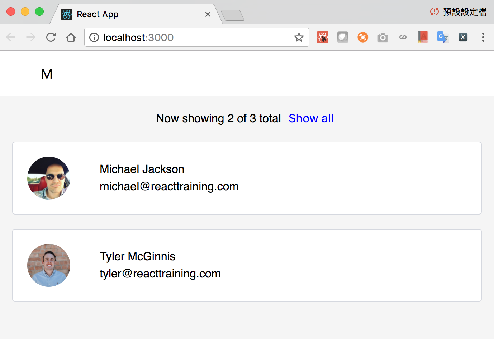
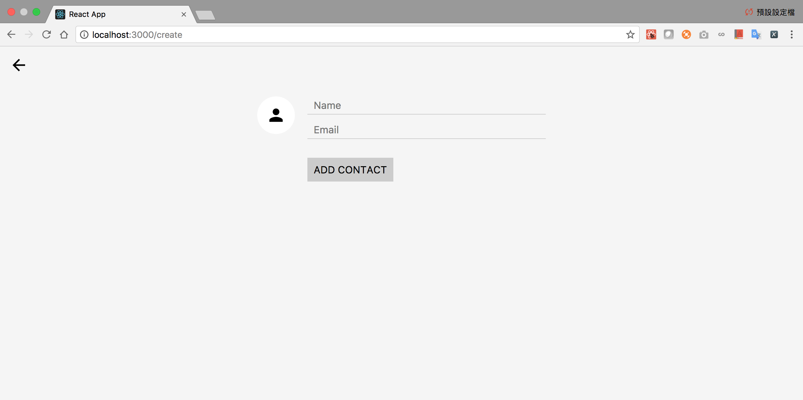

# Udacity-React-Lab
React practice for Udacity React Nanodegree

This repository is to show my practice for Udacity React Nanodegree.
Udacity provides server's code and some front-end starter code for us to start the lab.
This lab is mainly focus on building contact list part using React tools.

Contact-lists functionality:
- List all contacts with profile picture, name, and email
- Delete contact function
- Filter contact function
- Display current contacts stats and reshow all list function
- Create contact function with back button and forwrd function using React Router

#Quick view of this page:

This React Nanodegree is co-created by Udacity and React Training. If you want to learn more what content is covered in this React Nanodegree, please refer to the links: https://www.udacity.com/course/react-nanodegree--nd019
