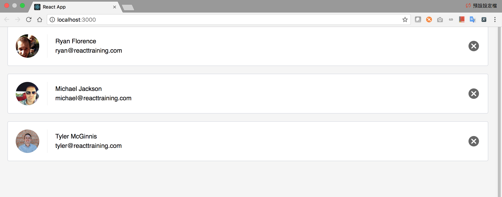

# Udacity-React-Lab
React practice for Udacity React Nanodegree

This repository is to show my practice for Udacity React Nanodegree.
Udacity provides server's code and some front-end starter code for us to start the lab.
This lab is mainly focus on building contact list part using React tools.

#Quick view of this page:

